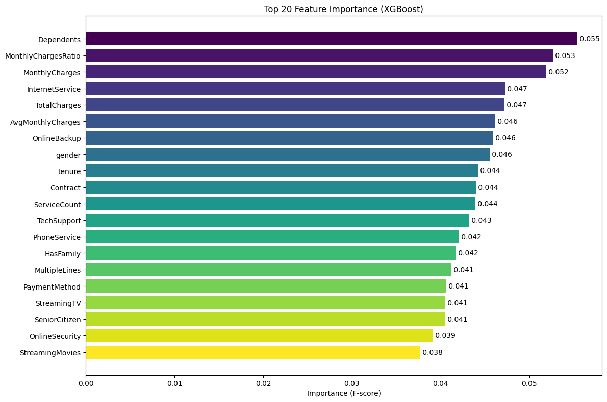

# Customer Churn Prediction ML Pipeline 🚀


## 📋 О проекте

**Customer Churn Prediction** - это production-ready ML система для предсказания оттока клиентов в телеком-компании. Проект демонстрирует полный цикл разработки ML решения: от анализа данных до развертывания REST API.

### 🎯 Бизнес-задача
Предсказать, какие клиенты с высокой вероятностью покинут компанию, чтобы бизнес мог вовремя предложить им специальные условия и удержать.

### 💡 Решение
Разработана end-to-end система, которая:
- Автоматически обрабатывает и подготавливает данные
- Создает новые признаки для улучшения качества предсказаний
- Обучает XGBoost модель с подбором параметров
- Предоставляет REST API для получения предсказаний в реальном времени

## 🏗️ Архитектура проекта
┌────────────┐    ┌────────────┐    ┌────────────┐
│ Raw Data   │ -> │ Preprocess │ -> │ Feature    │
│ (CSV)      │    │            │    │ Engineering│
└────────────┘    └────────────┘    └────────────┘
                                           │
                                           ▼
┌────────────┐    ┌────────────┐    ┌────────────┐
│ JSON       │ <- │ FastAPI    │ <- │ XGBoost    │
│ Response   │    │            │    │ Model      │
└────────────┘    └────────────┘    └────────────┘

## 📊 Датасет

Используется **Telco Customer Churn** датасет (IBM/Telco):
- **7,043** клиентов
- **21** признак (демография, услуги, платежи)
- Целевая переменная: Churn (Yes/No)

**Основные признаки:**
- 👤 Демография: пол, возраст, наличие партнера, иждивенцев
- 📱 Услуги: интернет, телефония, стриминг, безопасность
- 💰 Финансы: ежемесячные платежи, общая сумма
- 📅 Контракт: тип контракта, длительность обслуживания

## 📈 Результаты модели

| Метрика | Значение |
|---------|----------|
| **ROC-AUC** | 0.85 |
| **Accuracy** | 0.82 |
| **Precision** | 0.79 |
| **Recall** | 0.71 |
| **F1-Score** | 0.75 |

### Важность признаков


*График показывает топ-20 самых важных признаков для предсказания оттока*

## 🛠️ Технологический стек

- **Python 3.11** - основной язык
- **Pandas/NumPy** - обработка данных
- **Scikit-learn** - предобработка и метрики
- **XGBoost** - градиентный бустинг
- **FastAPI** - REST API фреймворк
- **Uvicorn** - ASGI сервер
- **Docker** - контейнеризация (опционально)
- **Pydantic** - валидация данных
- **Matplotlib/Seaborn** - визуализация
- **Joblib** - сериализация моделей

## 🚀 Быстрый старт

### Предварительные требования
- Python 3.11+
- pip
- virtualenv (рекомендуется)

### Установка и запуск

```bash
# 1. Клонируем репозиторий
git clone https://github.com/yourusername/ml-churn-prediction.git
cd ml-churn-prediction

# 2. Создаем виртуальное окружение
python3 -m venv venv
source venv/bin/activate  # для Mac/Linux
# или
# venv\Scripts\activate  # для Windows

# 3. Устанавливаем зависимости
pip install -r requirements.txt

# 4. Обучаем модель
python -m src.pipeline.training_pipeline

# 5. Запускаем API сервер
uvicorn src.api.main:app --reload --host 0.0.0.0 --port 8000